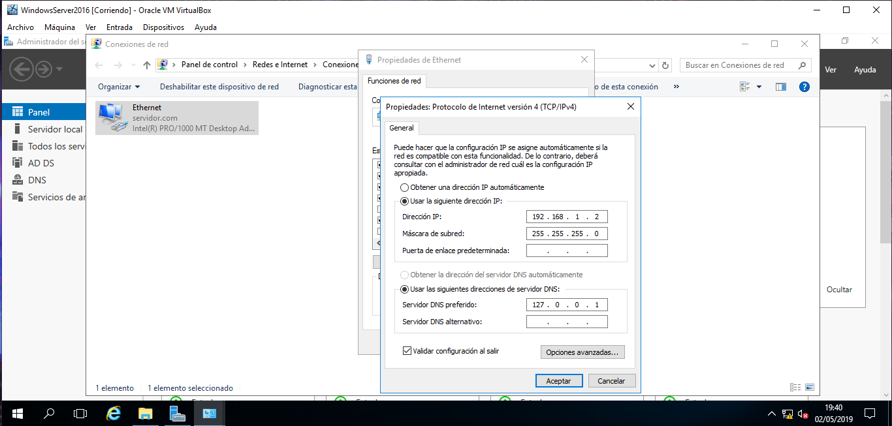
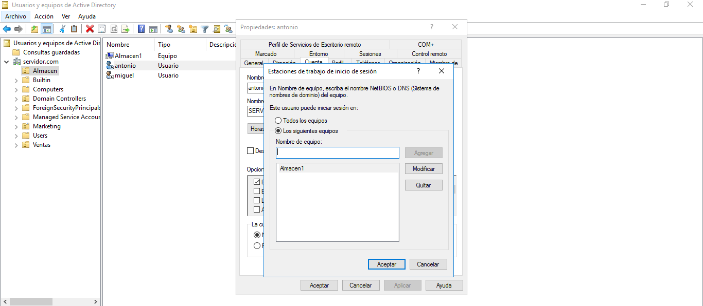
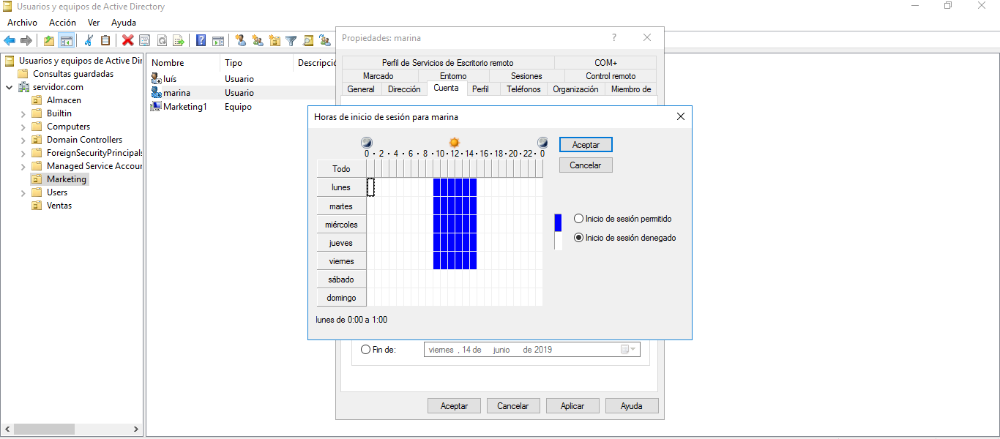
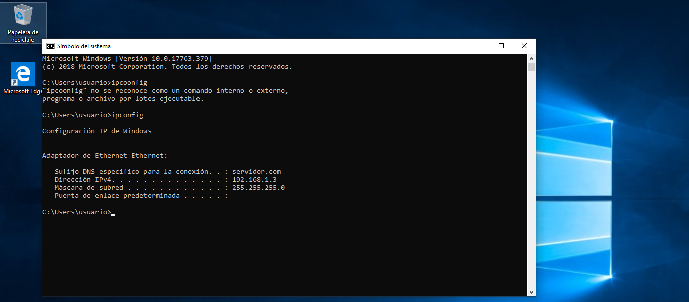

# Windows Server 2016 - Empresa
## Organización de la empresa
La empresa está organizada en tres departamentos los cuales son: Almacén, ventas y marketing. Cada departamento tiene un equipo y dos empleados que solo podrán entrar al equipo que está en su departamento.

En la empresa solo hay una impresora para todos.

Los usuarios solo podrán entrar al sistema de 9:00 a 15:00 de lunes a viernes.

Todo el sistema está en la red 192.168.1.0/24.

## Cambio de la IP y nombre del servidor
Antes de hacer nada en el servidor tenemos que hacer unas configuraciones básicas. Lo primero que haremos es cambiar el nombre del equipo a uno distintivo. También hay que cambiar la IP del servidor a una estática para que el servidor siempre esté accesible y no haya problemas de acceso desde los clientes.

## Instalación de Active Directory
Para que nuestro equipo empiece a funcionar como servidor necesitamos un servicio. Los servicioes se agregan desde el enlace de roles. Desde ahí siguiendo los pasos instalaremos el rol de Active Directory.

.PNG)

Una vez lo tenemos seleccionado solo tenemos que darle a siguiente hasta que nos de la opción de instalar.

.PNG)

.PNG)

Una vez se haya instalado nos aparecerá un mensaje en el que nos dirá que el rol ya ha sido instalado, pero eso no es todo, Ahora tendremos que configurarlo promoviendolo como controlador de dominio.

Lo primero que tenemos que configurar es la implementación que en nuestro caso escogeremos un nuebo bosque y además le daremos un nuevo nombre de dominio a nuestro servidor.

.PNG)

En las siguientes ventanas solo tendremos que elegir contraseña y comenzará la instalación.

.PNG)

.PNG)

## Creación de la unidad organizativa de la empresa
Nuestra empresa tiene tres departamentos en los que hay un equipo y dos empleados en cada uno. Lo primero que tenemos que hacer es crear la unidad organizativa, para ello hacemos clic en herramientas y nos vamos a la gestión de Active Directory. Desde hay hacemos clic derecho sobre servidor(local) y seleccionamos crear una nueva unidad organizativa a la que le daremos el nombre deseado.

.PNG)

Una vez la tenemos creada accedemos a ella con un doble clic y dentro de ella creamos carpetas para organizar los departamentos. Creamos una carpeta para Marketing, Almacen y Ventas. Dentro de esas carpetas meteremos los usuarios de cada departamento y su correspondiente equipo.

.PNG)

.PNG)

.PNG)

.PNG)

.PNG)

Ahora lo que tenemos que hacer es configurar los usuario. Para ello pondremos que los usuarios solo puedan entrar al equipo del departamento al que pertenecen.

Ahora vamos a limitar las horas en las que los usuario pueden iniciar sesión en el sistema.

Por último tenemos que agregar la impresora y para ello tenemos que agregar el rol al servidor.

.PNG)

Una vez instalado tenemos que configurarla y añadir la impresora.

.PNG)

.PNG)

## Instalación de DHCP
Lo siguiente que vamos a hacer es agregar un nuevo rol a nuestro servidor de DHCP. Esto lo hacemos de la misma forma en la que hemos añadido el Active Directory.

.PNG)

Después de añadirlo necesitamos configurarlo para que de el rango de IPs que nosotros queramos. Para ello lo que tenemos que hacer es agregar un nuevo ámbito.

.PNG)

Una vez configurado ya está listo para que reparta IPs a los equipos de la red.

## Comprobaciones
### Conexión
Lo que necesitamos hacer es cambiar el nombre del equipo a uno que tengamos en el servidor creado. Una vez tengamos eso tenemos que cambiar el grupo de trabajo por el dominio de nuestro servidor. Una vez hecho eso nos pedirá la contraseña del administrador del sistema del servidor y ya se tendra acceso con los usuarios utilizados después de reiniciar el equipo.

.PNG)

Una vez que hemos establecido la conexión vamos a intentar conectarnos con un usuario fuera de las horas establecidas, para comprobar que no se conecta.

.PNG)

.PNG)

Como vemos en la hora el usuario no va a poder entrar. Ahora vamos a cambiarle el acceso por horario y comprobar que entra.

.PNG)

.PNG)

.PNG)

.PNG)

### DHCP
La comprobación la hacemos desde un cliente en la misma red física y cofigurandolo como dhcp y comprobar que tiene una IP dentro de nuestro rango.

